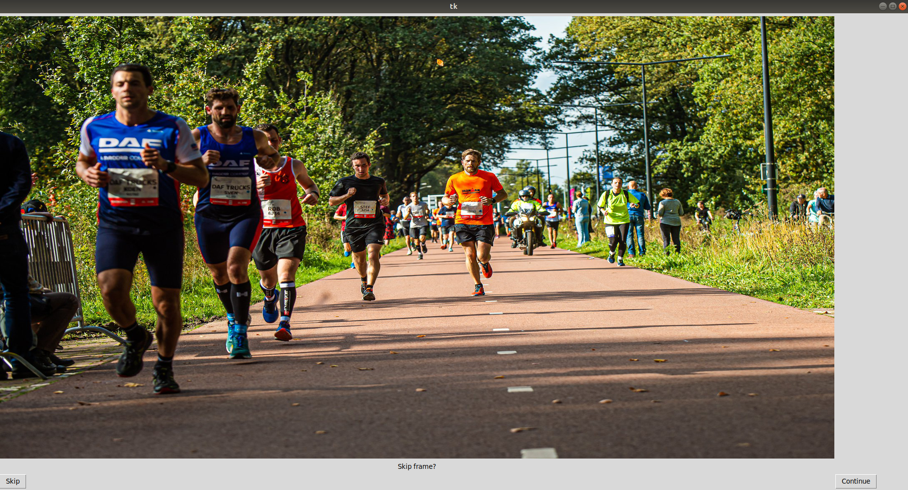
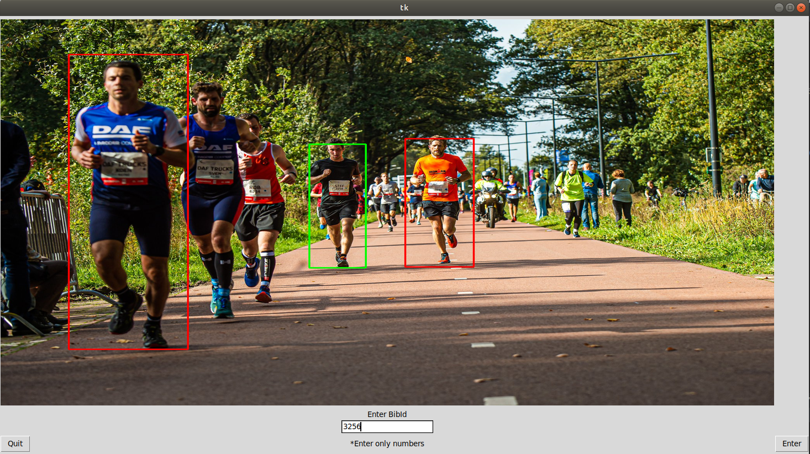

# Video_Annotator_YoloV3

For bounding box and labels based annotation of videos using YoloV3 

1. Clone the repository and install requirements

   `cd PyTorch-YOLOv3/`
   
   `sudo pip3 install -r requirements.txt`
   
2. Put your data in `data/samples/` folder

3. Run `python3 detect.py --image_folder data/samples/`

4. The system will take each image/frame and will ask to either annotate(Press `Continue`) or not(Press `Skip`)?

*Figure 1: Window 1*

5. If `Skip` is pressed, then next image/frame will be taken. If `Continue` is pressed then you will be asked to put the `label` value
 (in our case it's bibId of the runners). You can `Enter` a value or `Quit` if don't want to put any label for that object (in this case runner).
 
 
 
 *Figure 2: Window 2*
 
6. In the end, the annotateed images will be saved in the `output` folder.

## References
Above repo is retrieved from 
* <a name="ref1">[1]</a>  eriklindernoren .(2019, Dec). [PyTorch-YOLOv3](https://github.com/eriklindernoren/PyTorch-YOLOv3).

# Credit

YOLOv3: An Incremental Improvement
Joseph Redmon, Ali Farhadi

## Abstract

We present some updates to YOLO! We made a bunch of little design changes to make it better. We also trained this new network that’s pretty swell. It’s a little bigger than last time but more accurate. It’s still fast though, don’t worry. At 320 × 320 YOLOv3 runs in 22 ms at 28.2 mAP, as accurate as SSD but three times faster. When we look at the old .5 IOU mAP detection metric YOLOv3 is quite good. It achieves 57.9 AP50 in 51 ms on a Titan X, compared to 57.5 AP50 in 198 ms by RetinaNet, similar performance but 3.8× faster. As always, all the code is online at https://pjreddie.com/yolo/.

`@article{yolov3,
  title={YOLOv3: An Incremental Improvement},
  author={Redmon, Joseph and Farhadi, Ali},
  journal = {arXiv},
  year={2018}
}`
